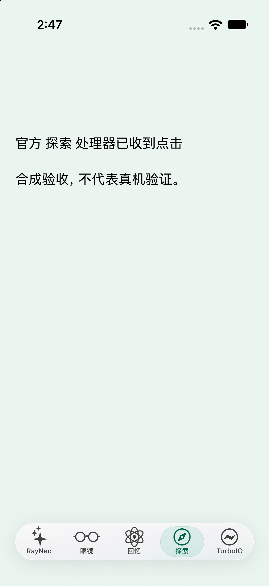
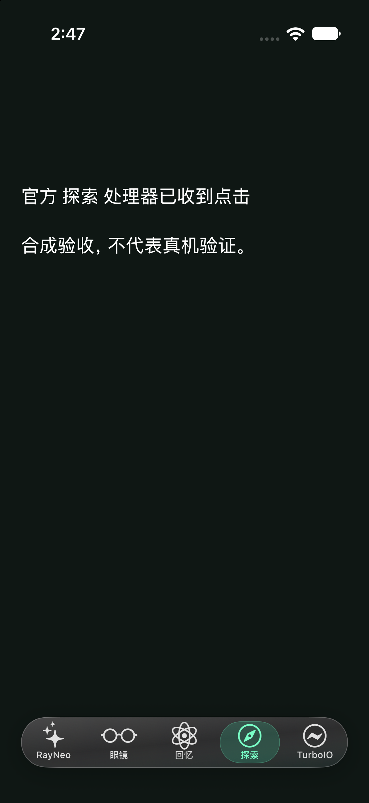

# 官方 App 1.0.4 / Strix OS 1.0.4.8 适配说明

更新日期：2026-09-15。本文针对 **V2 官方 App 扩展**，不是 V1 独立 SDK 的全量认证。本项目仅供开发者学习、研究与非商业使用；沿用根目录 PolyForm Noncommercial 1.0.0，不提供官方或修改版 IPA、固件、密钥、证书。

## 兼容矩阵

| 官方 iOS App | Build | Runner UUID | 状态 |
| --- | --- | --- | --- |
| 1.0.4 | 195 | `261c8e78f9553d7d85f713b9082972cf` | 本次新增；非越狱 iPhone Air 私用研究版回归 |
| 1.0.2 | 67 | `eeea85e54114313cb65173c90a6b5d3c` | 保留既有支持与历史验收；本次有旧布局回归测试 |
| 其他版本 / Android | — | — | 未适配，不应跳过校验强行合并 |

源 App Bundle ID 为 `com.rayneo.venus.pub`。版本、Build 和 UUID 必须成组匹配；仅修改 Info.plist 不能完成适配。打包工具与运行时各自检查同一名单，挂接前仍校验方法签名。UUID 用于定位经过研究的二进制，不是来源可信证明。

## 本次修改

1. 原生运行时、全天智记原生桥和本地合并工具新增精确 1.0.4 / 195 识别，保留旧版。未移除未知包、加密镜像或运行时签名不符时的拒绝逻辑。
2. 官方第三、第四个 Tab 从“记忆、发现”变为“回忆、探索”。适配器现在接受两套完整布局，原生按钮使用当前官方名称。不同页面混合、重复完整按钮或次序异常仍回退官方底栏。
3. TurboIO 第五项采用系统毛玻璃材质、边缘高光、阴影及淡绿选中态，支持深浅色。减少透明度开启时使用实色后备。这是 iOS 16+ UIKit 模糊材质，不要求 iOS 26 专属 Liquid Glass。
4. 冷启动按真实 Flutter 语义节点是否存在决定有限重试，不再把原生装饰视图误认为可用底栏。每次前台最多十次、间隔至少两秒，后台停止轮询。
5. 1.0.4 可使用已有字幕导航默认配置；每次会话仍重新建立 SID，并等待当前眼镜回执，不复用上次连接的成功状态。

五项底栏是原生导航适配层，不是向 Flutter 业务枚举增加一个值。前四项通过真实 `accessibilityActivate` 调用官方处理器；第五项打开扩展界面。没有固定坐标点击，不改登录流程，也不改眼镜系统 UI。

## 已验证与仍需验证

| 项目 | 证据及边界 |
| --- | --- |
| 固件升级 | 私用研究版完成 1.0.3.15 → **Strix OS 1.0.4.8** 的官方 OTA；重新连接后的设备版本回读确认，不只看下载目标版本 |
| 官方语音 / 自有模型 | 用户在非越狱 Air 上反馈升级后正常；所要求的长回答、收尾和插话回归获得正常反馈，不外推每个服务提供商 |
| 导航 | 用户反馈升级后导航正常；未逐项记录步行、骑行、驾车及全部路线条件，因此不宣布三模式户外全面验收 |
| 新底栏 | 真机加载 `home-tabs-v6-frosted-glass`，识别新版四个官方入口，原生五项视图状态为显示；毛玻璃最终真机观感不以日志代替 |
| 模拟器 | 新名称、四入口处理器、TurboIO 打开和返回、冷启动、深浅色检查；使用合成语义树，不是官方 Flutter 真机测试 |
| 公开版构建 | 本次对脱敏源码重新测试、编译；公开版保留空白用户资料、自行配置 Key，与私用包不完全相同 |
| 未完成 | 长时间后台、全部固件、三种出行方式的户外路线、录音/智记完整回归、APNs 及其他 Agent 执行器不在本次完成范围 |

导航现有安全范围不变：眼镜常亮字幕仅开放模拟验收，4 分钟保护；手机实时导航仅前台。不建议把本项目用作可靠性已认证的出行导航。

## 升级 / 使用

1. 备份现有数据，保留可恢复的原 App。不要为本次 UI 或固件适配自动解绑、重置眼镜。
2. 拉取最新源码，使用自己的可信、合法可用且未加密的兼容 `Runner.app`。工具不获取或解密官方应用。
3. 按 [V2 构建与签名步骤](../README.md#本地合并签名安装) 编译扩展、合并并使用自己的签名。需要地图时按 [导航教程](NAVIGATION.md) 获取指定高德 SDK，并配置与签名 Bundle ID 对应的个人 iOS Key。默认构建不包含在线地图 SDK。
4. 在 TurboIO 中填写模型、搜索、知识库等自己的服务配置；公开源码不预置维护者身份或凭据。
5. 打开首页应看到 **RayNeo / 眼镜 / 回忆 / 探索 / TurboIO**；逐个切换原入口，再打开 TurboIO 并返回。随后测试一次官方语音、自有模型短答/长答、停止与导航模拟。
6. 固件升级仍由用户在官方流程中确认；本仓库不刷写或分发固件。升级后重新验收，不把本次结果外推到后续未知固件。

这是 V2 在同一官方宿主内增加扩展，不需要另起 V1 客户端抢占连接。若切换到 V1 独立客户端，才按 V1 配对说明先在官方解绑、系统蓝牙忽略，再重新配对；两条路线不要同时连接。

## 毛玻璃预览

下面是无账号、无密钥、无眼镜的 UIKit 合成验收截图。背景含模拟四项底栏，用于观察模糊遮挡，不是官方首页截图，更不是镜片画面。

<p>
  
  
</p>

在已启动的 iPhone 模拟器上复现（无需官方 App 或服务 Key）：

```sh
bash official-addon/preview/build.sh
xcrun simctl install booted official-addon/build/research-preview/ResearchPreview.app
xcrun simctl launch --terminate-running-process booted io.turboio.research.preview \
  --home-tabs --home-app104 --glass-sample --home-tests --cold-start
```

不加 `--home-app104` 可回归旧名称。`--home-tests` 会自动调用合成处理器并测试返回；不操作真实眼镜。深浅色可通过模拟器系统外观切换。

## 底栏不出现时

- 先核对 App **1.0.4 / 195** 和 Runner UUID；确认重新构建、签名、安装的是当前扩展，不是仅升级官方 App。
- 返回官方首页、关闭键盘或弹层，等待语义树就绪。识别不完整时保留官方底栏和研究浮动入口，不盲目覆盖其他页面。
- VoiceOver 开启时保留官方导航；长按 TurboIO 约 1.5 秒可在当前进程临时恢复官方底栏，重启恢复适配。
- 本机诊断 `Library/Application Support/TurboIOPrivateAddon/HomeTabs-status.json` 应出现修订号 `home-tabs-v6-frosted-glass`。只含白名单标签、几何和状态，不记录页面正文。`visible=1` 是视图状态，不等于人眼可读性验收。
- 毛玻璃在纯色背景上会更接近柔和的浅色胶囊；系统“减少透明度”开启时按辅助功能偏好退回实色。
- 提交问题请提供版本组合、复现步骤和脱敏截图；不要提交沙盒备份、录音、聊天、API Key、证书、设备标识或原始日志。
